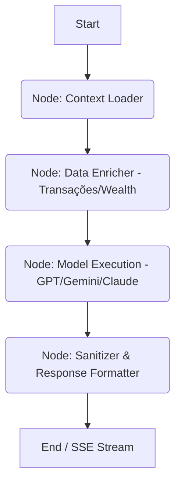

# Discovery Notes — MetaFin AI Expansion
>
> Arquivo gerado automaticamente durante o workflow /build-saas.
> Fonte de verdade para geração dos PRDs. Não edite manualmente.

## Visão

- **Problema**: Evoluir o chat financeiro básico para um Advisor Multimodelo completo.
- **Público-alvo**:
  - Pessoa física focada em Independência Financeira (FIRE) e Wealth.
  - Freelancer/Autônomo (Separação pessoal/profissional).
  - Donos de pequenos negócios (CFO Digital).
- **Diferencial (IA Advisor)**:
  - Conselhos proativos baseados em padrões de consumo.
  - Suporte multimodal (análise de imagens/extratos).
  - Seleção de modelos (GPT-4o, Gemini, Claude).
  - Consultoria de Wealth/Investimentos em tempo real.

- **Interação do Advisor**: Mix entre Passivo (Chat), Reativo (Briefings no Dashboard) e Preditivo (Alertas de metas e tendências).
- **Prioridades Multimodais (Visão)**:
    1. OCR de PDFs de extratos bancários.
    2. OCR de fotos de notas fiscais/cupons (Categorização).
    3. Análise de gráficos de Investimentos (Ações/Cripto).

## Funcionalidades

- [ ] Advisor Multimodelo (Seletor de IA - GPT/Gemini/Claude)
- [ ] Briefing Diário no Dashboard (Reativo)
- [ ] Sistema de Alertas Preditivos (FIRE/Orçamento)
- [ ] OCR de Extratos (PDF)
- [ ] OCR de Cupons Fiscais (Imagens)
- [ ] Consultoria de Ativos via Visão (Gráficos)

## Monetização

- **Modelo**: Freemium.
- **Grátis**: IA básica (Gemini Flash / Agente Local).
- **Pro**: Advisor Multimodelo (GPT-4o, Claude 3.5, Gemini Pro) + Funcionalidades de Visão (OCR/Gráficos).

## Técnico

- **Stack**: React (Vite) + Supabase (Auth/DB/Edge Functions).
- **IA**: Integração multimodelo via backend proxy (Nexus AI).
- **Mobile**: Web responsiva (PWA de alta fidelidade).

## Contexto

- **Timeline**: Sem pressa (foco na perfeição e profundidade).
- **Layout**: Sidebar dedicada no Dashboard para Insights Proativos.
- **Integração Core**: Advisor centralizado e integrado ao Wealth Lab (Simuladores/Metas).

## PRD — User Stories

### 🎯 Core Persona: FIRE & Wealth

- **U.S. 1.1**: Como investidor focado em FIRE, quero que o Advisor analise meu patrimônio e sugira aportes, para que eu atinja minha aposentadoria antecipada mais rápido.
- **U.S. 1.2**: Como investidor, quero que o Advisor recalcule minha data de "liberdade financeira" sempre que eu fizer um aporte extraordinário, para manter minha motivação alta.

### 🎯 Core Persona: Freelancer / CFO

- **U.S. 2.1**: Como freelancer, quero fazer upload de um extrato PDF e ter as transações categorizadas automaticamente, para economizar tempo na gestão financeira.
- **U.S. 2.2**: Como Freelancer, quero marcar certas transações como "Comerciais", para que o Advisor gere um relatório de lucro líquido separado das despesas pessoais.

### 🎯 Core Persona: Pro User (Power AI)

- **U.S. 3.1**: Como usuário Pro, quero enviar um print de um gráfico de ações, para que o Advisor analise a tendência técnica e me dê insights.
- **U.S. 3.2**: Como usuario Pro, quero alternar o motor de IA entre GPT-4o e Claude 3.5, para obter diferentes perspectivas sobre minhas análises complexas.
- **U.S. 3.3**: Como usuario móvel, quero fotografar um cupom fiscal, para que o Advisor extraia os valores e categorize o gasto automaticamente.

### 🎯 Core Feature: Proactive Nexus sidebar

- **U.S. 4.1**: Como usuario do MetaFin, quero visualizar um "Nexus Sidebar" no dashboard, para receber resumos diários de saúde financeira sem precisar perguntar.

## PRD — Requisitos Funcionais

### 🤖 Nexus AI Engine (Advisor Multimodelo)

- **RF 1.1**: O sistema deve integrar APIs da OpenAI (GPT-4o), Anthropic (Claude 3.5) e Google (Gemini 1.5 Pro).
- **RF 1.2**: Usuários Pro devem poder alternar o modelo de IA no chat e nas análises.
- **RF 1.3**: O sistema deve manter um histórico de conversas do Advisor sincronizado via Supabase.
- **RF 1.4**: O Advisor deve ter acesso de leitura às tabelas de `transactions` e `wealth_goals` para fornecer contexto real.

### 📊 Nexus Sidebar (Insights Proativos)

- **RF 2.1**: Deve existir uma sidebar lateral no Dashboard dedicada a "Insights do Nexus".
- **RF 2.2**: O sistema deve gerar um "Daily Briefing" automático ao carregar o dashboard (Saldos, Alertas de Orçamento).
- **RF 2.3**: O Advisor deve sugerir aportes no Wealth Lab baseando-se no saldo disponível e metas de aposentadoria.

### 👁️ Vision & Multimodalidade

- **RF 3.1**: Suporte para upload de arquivos PDF (extratos) com extração automática de transações via IA.
- **RF 3.2**: Suporte para upload de fotos (cupons) com categorização automática.
- **RF 3.3**: Funcionalidade de "Análise de Ativo" via captura de tela de gráficos de mercado.

### 💳 Assinaturas & Billing (Stripe)

- **RF 4.1**: Bloqueio de funcionalidades Premium (GPT-4o, Claude 3.5, Vision) para usuários não-Pro.
- **RF 4.2**: Integração com Stripe Billing Portal para gestão de assinatura pelo usuário.

## PRD — Requisitos Não-Funcionais

- **RNF 1.1 (Security)**: Toda comunicação multimodelo deve passar pelo backend proxy autenticado para proteger chaves de API.
- **RNF 1.2 (Performance)**: Respostas da IA devem ser via Streaming (SSE) para reduzir o tempo de percepção do usuário.
- **RNF 1.3 (UX)**: Todos os novos componentes de IA devem seguir o Design System 3D Premium (Efeito Glassmorphism).

## Database — Entidades e Relações

## Backend — Endpoints e Integrações

### 📌 API Nexus (Vercel Serverless / Supabase Edge)

- **POST `/api/nexus/chat`**: Endpoint principal multimodelo (GPT/Claude/Gemini). Suporta Streaming (SSE).
- **POST `/api/nexus/vision`**: Recebe arquivos/imagens. Usa Gemini 1.5 Flash (OCR Simples) para extrair dados e injetar no chat ou criar transação.
- **GET `/api/nexus/insights`**: Recupera o briefing diário (1x ao dia). Se não houver do dia atual, dispara o processamento.
- **POST `/api/nexus/action`**: Executa ações sugeridas pela IA (ex: criar transação aprovada via OCR).

### 📌 Integrações

- **Google Generative AI**: Gemini 1.5 Pro (Advisor) e 1.5 Flash (OCR/Velocidade).
- **OpenAI/Anthropic**: Nexus Gateway para redundância multimodelo.

## Backend — Agent Graph (Nexus Linear Flow)

1. **Context Loader**: Recebe o prompt do usuário e o histórico de chat.
2. **Data Enricher**: Busca dados financeiros no banco baseados na pergunta.
3. **Model Execution**: Envia o contexto consolidado para o modelo escolhido (Pro) ou padrão (Free).
4. **Sanitizer**: Valida a resposta e formata para o frontend (Markdown/JSON).

## Frontend — Páginas e Componentes

### 🛸 Nexus Spotlight (Command Center)

- **Componente**: `NexusSpotlight.jsx`
- **UX**: Modal estilo "Spotlight" (atalho Cmd+K / Ctrl+K) visível em qualquer página.
- **Função**: Chat com Advisor, seleção de modelos (GPT/Claude/Gemini) e busca global.
- **Estética**: Glassmorphism com desfoque de fundo (backdrop-blur) e bordas neon.

### 🍱 Nexus Insight Drawer (Sidebar Colapsável)

- **Componente**: `NexusInsightDrawer.jsx`
- **UX**: Sidebar colapsável no lado direito do Dashboard. Botão "Nexus" flutuante abre a gaveta.
- **Função**: Exibe o "Daily Briefing", alertas de orçamento e sugestões de aportes FIRE.
- **Estética**: Cartões 3D elevados dentro de um painel translúcido.

### 📥 Nexus Dropzone (Multimodal Ingestion)

- **Componente**: `NexusDropzone.jsx`
- **UX**: Área de "Drag & Drop" persistente no topo do Dashboard ou dentro do Spotlight.
- **Função**: Recebe PDFs/Imagens, processa via Gemini Flash e redireciona para confirmação de transação.

## Frontend — Design System

- **Tokens**: Expandir `tw.card` para incluir `tw.nexusInner` (bordas roxas/violeta para elementos de IA).
- **Animações**: Framer Motion para transições de abertura do Spotlight e entrada dos cards de insight.
- **Ícones**: Lucide React (`Sparkles`, `Command`, `ScanEye`, `BrainCircuit`).

## Security — Decisões

- **SD 1.1**: O Nexus Spotlight deve validar o tier do usuário (Free/Pro) antes de habilitar modelos Premium.
- **SD 1.2 (Privacy First)**: Arquivos enviados via Dropzone (PDFs/Imagens) são processados em memória e deletados IMEDIATAMENTE após a extração pela IA. Nenhum dado visual é persistido.
- **SD 1.3 (Rate Limiting)**: Limite estrito de **8 requisições de IA por minuto** por usuário para proteger cotas de API.
- **SD 1.4 (Backend Proxy)**: Todas as chaves de API LLM em variáveis de ambiente protegidas no backend.
